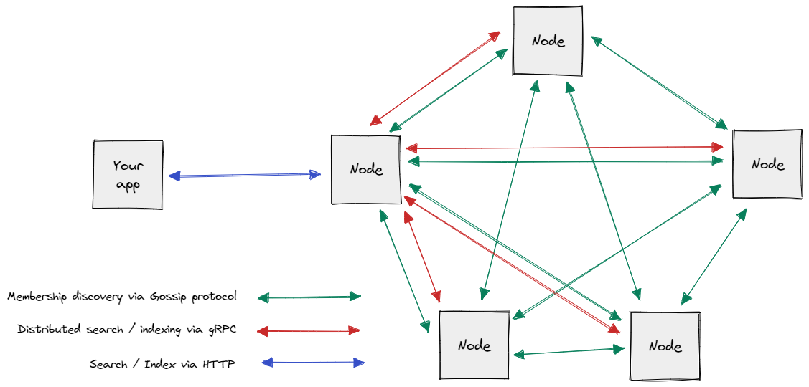

# Bayard

Bayard is a full-text search and indexing server with cluster membership discovery by SWIM Protocol.  
Bayard provides endpoints through gRPC and RESTful API.  
Bayard makes easy for programmers to develop search applications with advanced features and high availability.

## Features

- Full-text search
- Multiple indices
- Index sharding
- Index replication
- Distributed search and indexing
- JSON-based query DSL
- JSON-based index definition (index schema and analyzers)
- Multilingual support
- Easy to bring up a multi-node cluster
- Gossip-based membership discovery
- Internal cluster communication via gRPC
- Master node-less cluster
- RESTful API

## Table of Contents

- [Getting Started](./docs/getting_started.md)
- [Schema](./docs/schema.md)
- [Analyzers](./docs/analyzers.md)
- [Query DSL](./docs/query_dsl.md)
- [REST API](./docs/rest_api.md)
- [Bring up a multi-node cluster](./docs/multi_node_cluster.md)
